# 期末应用项目开发成果

## 策划
#### 站长: 周铭峰 1910130030

## 策划文档
### 网站主题：[寻找你的思考](https://happydayzzz.xyz/)

#### 网站建设目标与主题价值
+ 提供优质文章，定期转载文章，给读者在自己的时间里通过阅读激发思考。
+ 通过文章来给予用户途径进行思考，激发起用户的思维，了解深入打开视野，在生活中有更多的自我见解和更多的了解新闻

#### 目标用户画像

### 网站规划
|规划|内容|
|:----:|:----|
|前期|通过打造笔记，推荐电影，时事评论更多模块，持续转载高质量的文章，为广大读者提供优质文章。根据用户的建议保持改良网站的平面设计、交互设计和文章排版，提高网站的易用性和可读性。|
|中期|为网站做更多的seo，提高网站的点击量，做好网站的的安全防护工作，多产出原创文章，提高更新速度。|
|后期|开设新的功能或分类，是网站的内容更丰富多样，持续与用户互动，与其他网站合作增加网站曝光率。|

#### DVF模型定义需求
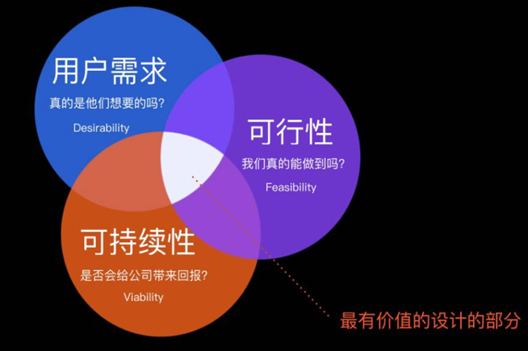

| 规划|内容|
|:----:|:----|
|用户需求|阅读者需要一些文章推荐，文章阅读|
|可行性|基于对阅读的倡导，网站提供阅读文章，作者推荐，满足阅读者们的真正需求。|
|可持续性|开设新的功能或分类，是网站的内容更丰富多样，持续与用户互动，与其他网站合作增加网站曝光率。|

### 网站地图
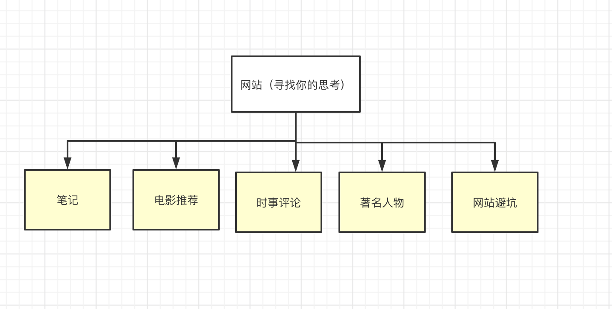

### 平面设计插件使用：

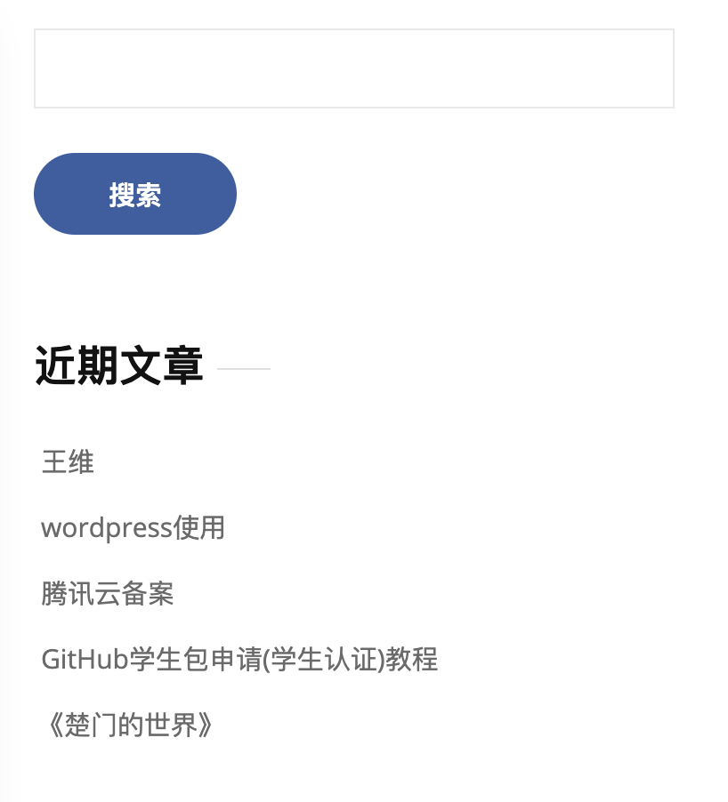    
1.当鼠标悬停在搜索框时，会出现模块放大后再缩小到初始的效果，让用户感受乐趣。

2.当鼠标悬在近期文章时，会出现模块跳动的效果，刺激用户观感。

+ #### SiteOrigin，内链外链

1.文章末尾添加了“推荐”功能，让用户体验到快捷方便的操作感受。

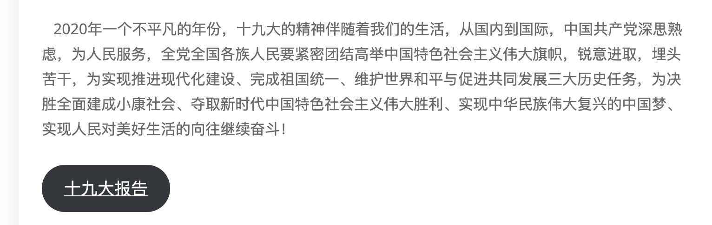
[点击文章查看效果](https://happydayzzz.xyz/2021/01/11/%e8%af%bb%e5%8d%81%e4%b9%9d%e5%a4%a7%e6%8a%a5%e5%91%8a/)

2.文章末尾添加一个按钮点击观看视频，跳转到外链，让读者更多的了解。

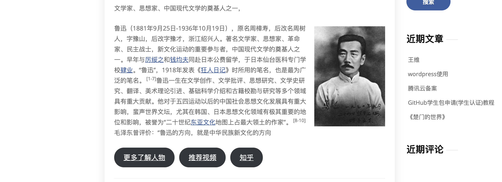
[点击文章查看效果](https://happydayzzz.xyz/2021/01/13/%e9%b2%81%e8%bf%85/)

3.内部链接，直接在页面中点击按钮阅读文章
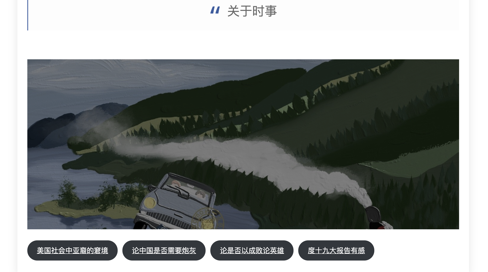
[点击文章查看效果](https://happydayzzz.xyz/%e6%97%b6%e4%ba%8b%e8%af%84%e4%bb%b7/)
### 配色协调

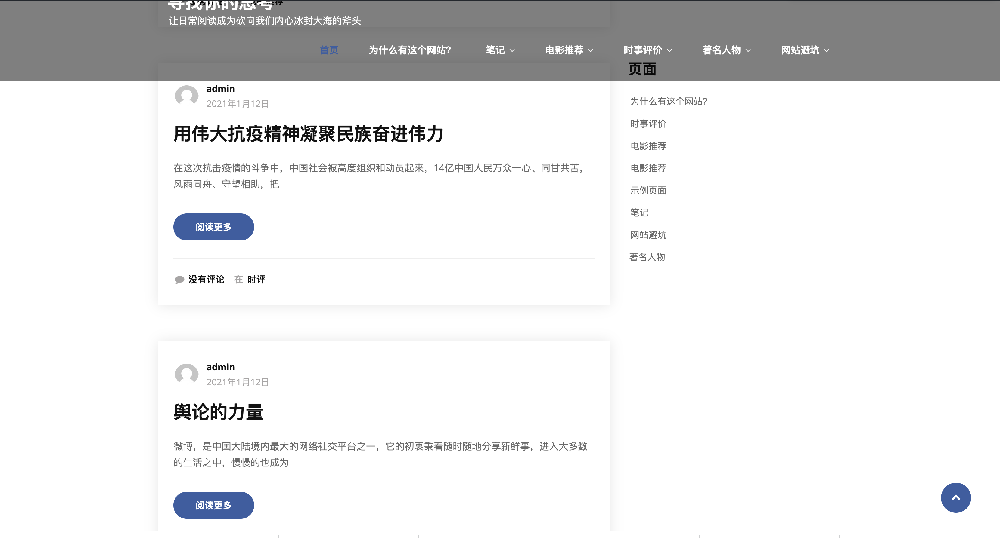

+ 网站配色、对比度与可读性
网站以白色为底色，用户只点击专栏后下滑即可浏览，简洁明了，直击主题。

+ 版权使用
本网站非原创文章在文章末尾添加版权交代。如下图所示：
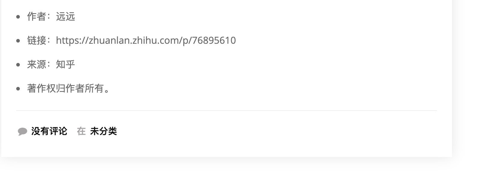  

+ 图库风格及配色
图片风格的选择均与主题密切相关，配色也与文章有较好的连接性。
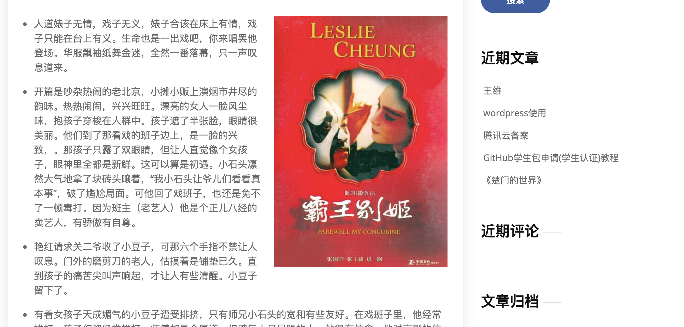

### 原创文章十篇

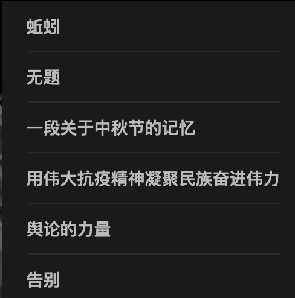 

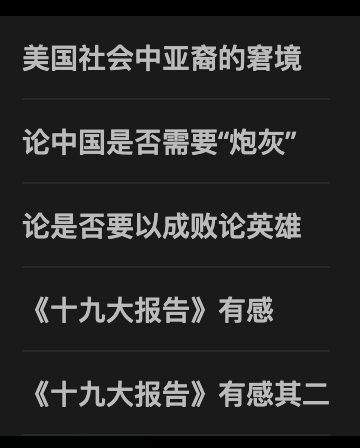

---

## 管理
#### 云端架站(域名实践，并添加了https)
域名：[https://happydayzzz.xyz/](https://happydayzzz.xyz/)

#### 网站安全
使用Wordfence进行实时监控
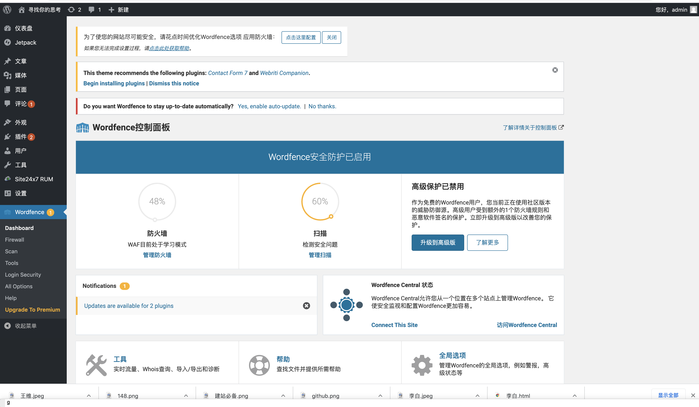
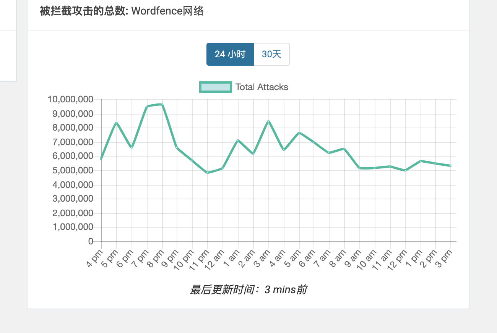
> 通过观察上面2张截图，我们可以看出网站相对处于一个有风险的状态，仍在进行完善中；第二图展示了WordFence日常的阻止攻击，保障网站安全。

#### 网站性能
+ 启用了2个监视器对网站进行实时监测
> 通过Sit24x7监视器观测到网站无异常、无中断、无告警历史，处于较稳定的状态，所有服务运行正常。

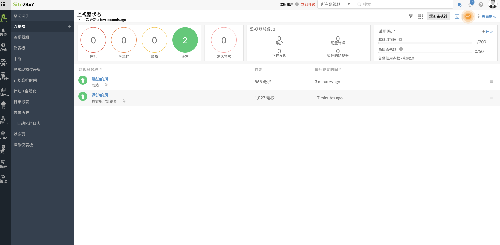

+ 八个不同位置的可用性与响应时间
> 图例展示了各地八个不同位置的可用性基本为100%，可用性强，没有存在问题。

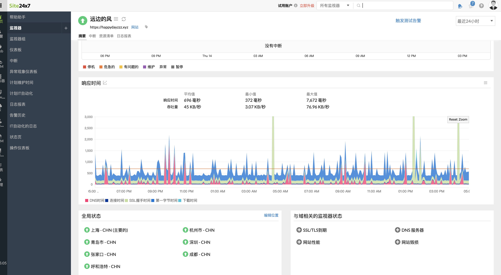

+ 响应时间是1.68秒左右，没有停机时间
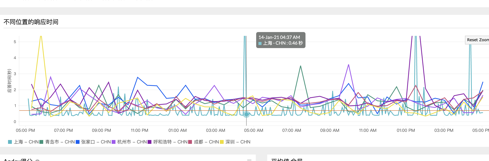

#### 网站备份
1. 运用WinSCP
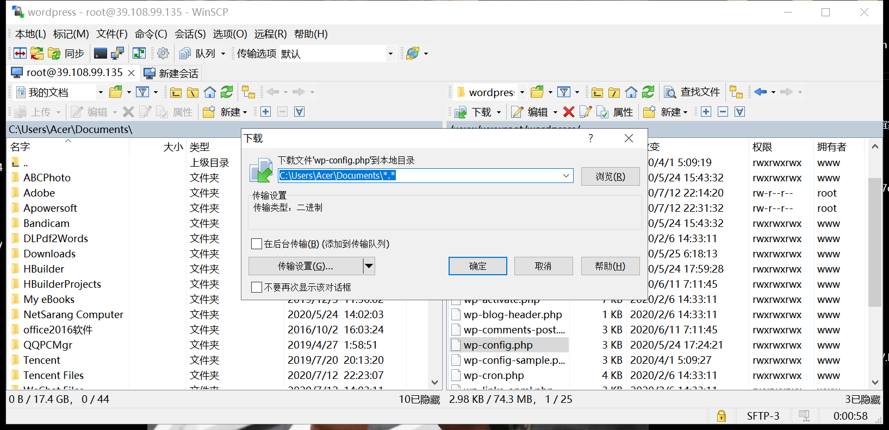
2.使用Wordpress后台导出工具
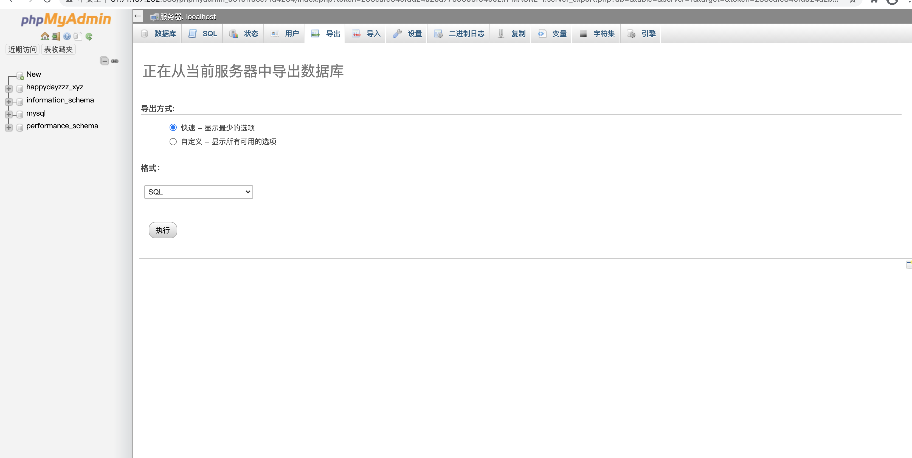

--- 
### SEO优化

#### 1. SEO关键词优化
+ 改进前：
> SEO分数显示为灰色子弹（即没有设置文章关键词等）；

+ 改进后：
> 通过对文章关键词、元描述的修改，添加，SEO分数提高了。

+ 改进前：
> 无内部与出站链接，SEO分数较低

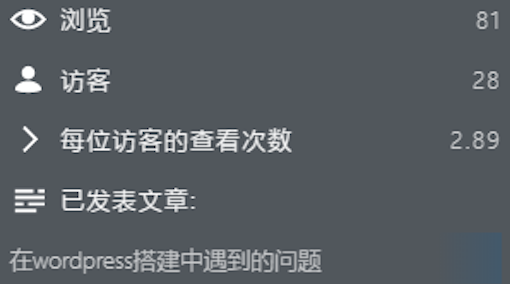

+ 改进后：
> 添加了相应的Baller内部链接与出站链接，SEO分数得到提高

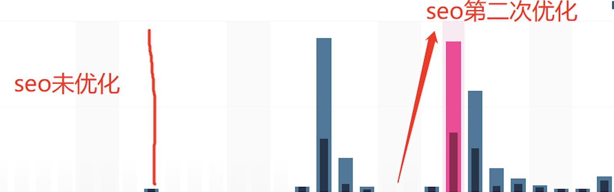

#### 3. 文章原创率检查
> 在原创的三篇文章中，进行在线原创率检查。检查得出，文章原创分数高，原创率在90%，无存在伪原创现象，可发布。

#### SEO优化后流量统计

> 可以看出，在1月5日SEO优化前，网站浏览量几乎为0，此后运用多种方法进行SEO优化，可以发现从1月6号开始网站浏览量不断上升，说明SEO优化效果好，为网站获得了日益上升的浏览量。

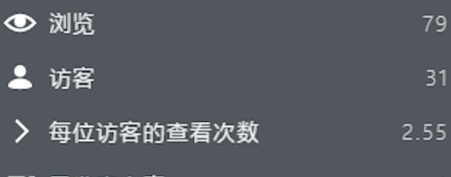
> 在seo第二次优化后，访问量又得到了上涨！seo真的非常好
### 用户测评
#### 方法1——用户访谈与测评：

+ 测评问题：
	1.我们的应用是否解决了你们的需求
	2.我们哪些地方让你们觉得不够好的
	3.你们平时除了使用我们的应用之外还会使用哪些
	4.你们觉得你们还有哪些需求是我们现在无法满足的
	5.你们一般多久使用我们的应用
通过用户访谈，网站制作者从一些建议性回馈中改进网站的相关设计
+ 访谈成果：。
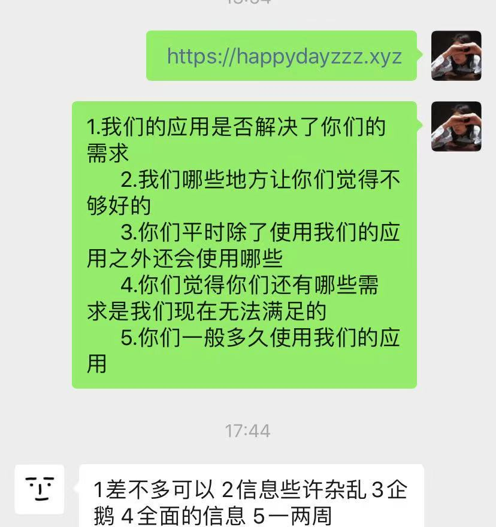
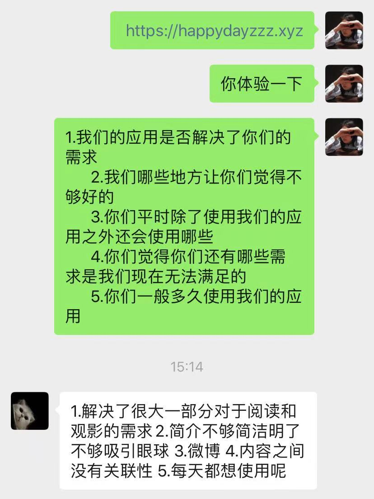
### 站长工具
1.百度站长

2.Bing站长

### 小程序链接

